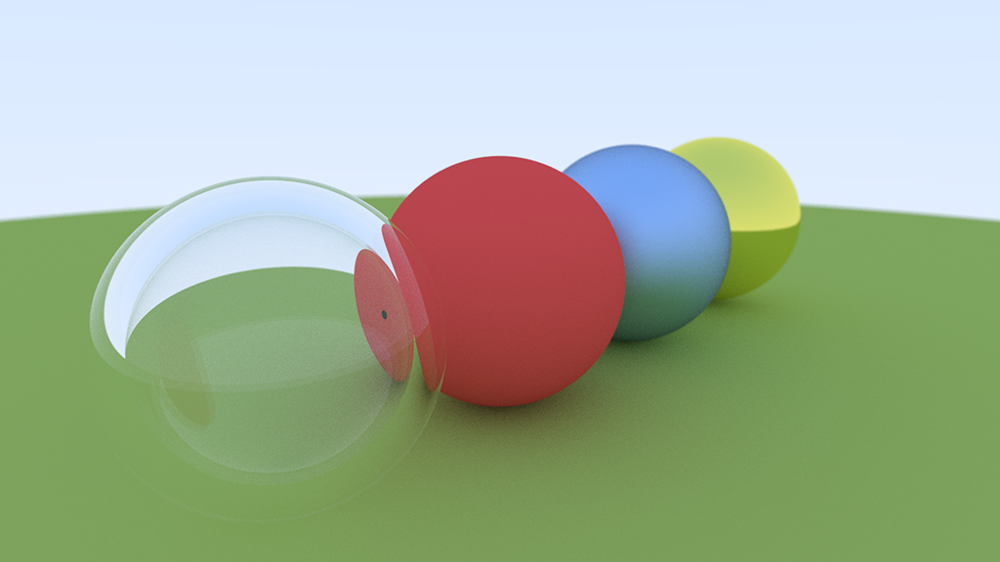

# Ray Tracer

A simple brute force path tracer written in C++.



## Disclaimer

This is an educational project. This means...

* I haven't put much effort into the data pipeline yet. Scenes and paths are hardcoded. You may have to adjust it for your needs.
* The code is not optimized, neither in terms of run-time nor space complexity (though that will hopefully change at some point in the future).
* As of right now no acceleration structures have been implemented. Therefore, rendering is especially slow for meshes.
* I try to keep a clean architecture, but I don't promise anything :P

## How to Build (Win64)

1. Run `GenerateProjectFiles.bat`.
2. Open the generated solution with VS2022.
3. Build in the desired configuration (debug / release)

## How to Run

For now, a very specific folder structure is assumed to run the application:

```
RootDir
    |- raytracer.exe (i.e. the build artifact)   
    |- Assets/
        |- Meshes/
            |- <your_meshes>
```

You don't have to copy files around if you run directly from within the IDE.

### From IDE

* Set `Working Directory` to `$(SolutionDir)`
* Press run
* Your output will be saved at `$(SolutionDir)/output.png`

## Dependencies

* [Assimp](https://github.com/assimp/assimp)
* [spdlog](https://github.com/gabime/spdlog)
* [STB](https://github.com/nothings/stb)

## Acknowledgments

* Build configuration powered by [Premake5](https://premake.github.io/)
* The renderer was tested with models taken from the [Stanford Computer Graphics Laboratory](https://graphics.stanford.edu/data/3Dscanrep/), e.g. the Stanford Bunny.
* The implementation is based on the following resources:
    * [Ray Tracing in One Weekend Book Series](https://raytracing.github.io/)
    * [Scratchapixel](https://www.scratchapixel.com)
    